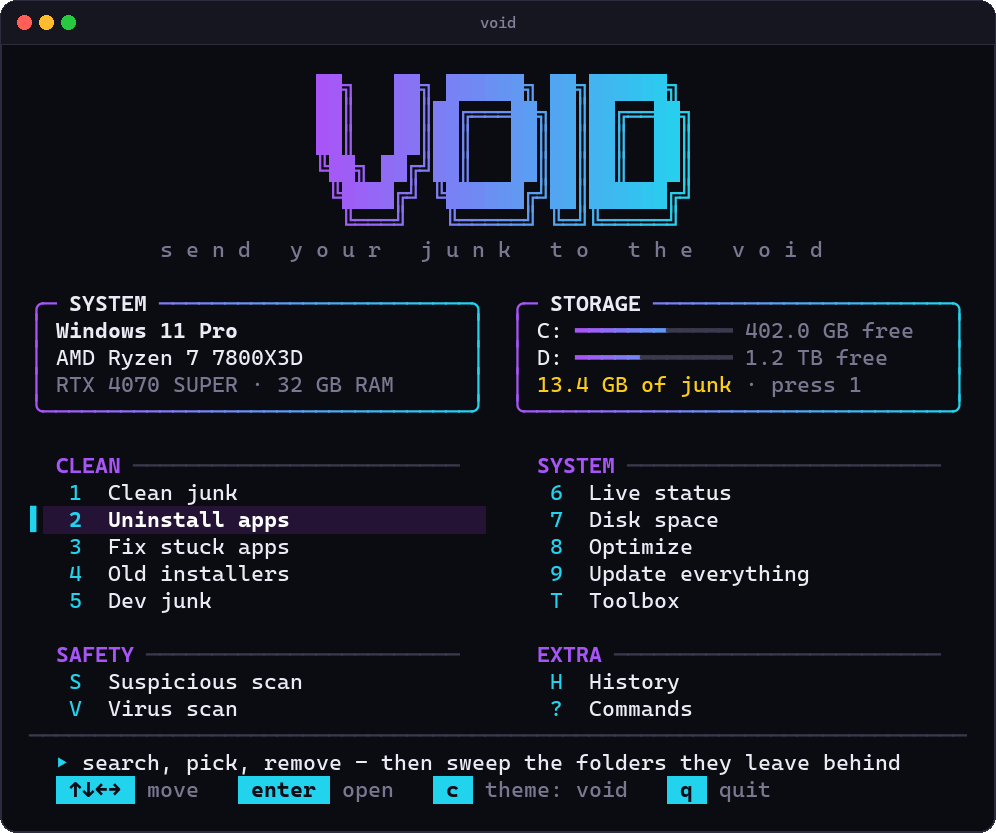
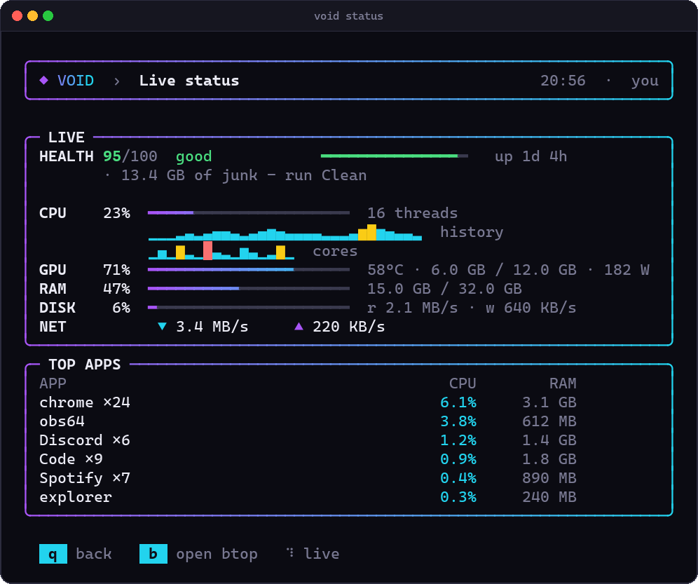
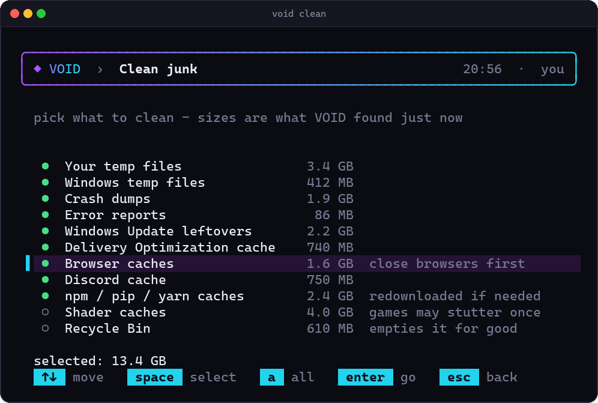
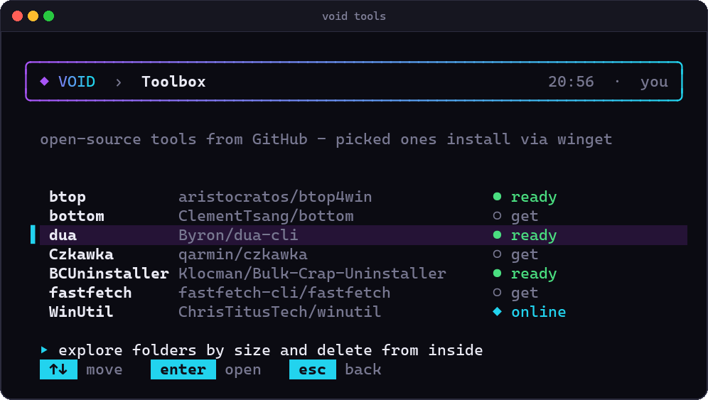
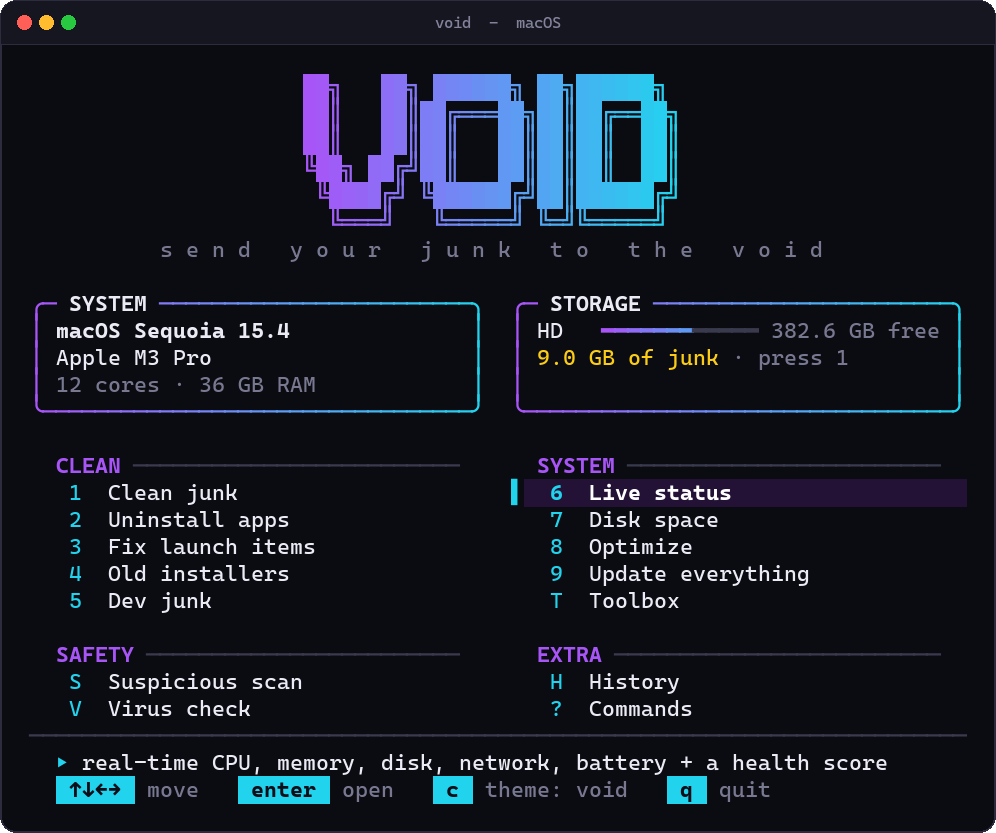
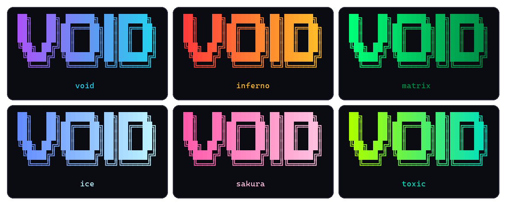

<div align="center">


# VOID

### send your junk to the void.

An all-in-one cleanup and system toolkit that lives in your terminal and actually looks good doing it.<br>
Clean junk, rip out apps *and* their leftovers, watch your system live, and launch the best open-source tools, all from one command.

<br>


**zero dependencies · one file · nothing to compile**

</div>

---

## ⚡ Install

**Windows**: open PowerShell and paste:

```powershell
irm https://raw.githubusercontent.com/kelcum/void/main/install.ps1 | iex
```

**macOS**: open Terminal and paste:

```bash
curl -fsSL https://raw.githubusercontent.com/kelcum/void/main/install.sh | bash
```

Then just type **`void`**. That's it.

> On Windows it also works from **Win + R → `void`** and adds a **VOID** shortcut to your desktop and Start menu.
> On macOS you get a **`VOID.command`** on your desktop you can double-click.

<details>
<summary>Prefer to install from a download?</summary>

Clone or download this repo, then:

- **Windows**: double-click `Install VOID.cmd`
- **macOS**: run `bash install.sh`

</details>

---

## 👀 What it looks like

<div align="center">

</div>

<table>
<tr>
<td width="50%"></td>
<td width="50%"></td>
</tr>
<tr>
<td align="center"><b>Live status</b> · real-time CPU, GPU, RAM, disk, network + a health score</td>
<td align="center"><b>Clean junk</b> · see exactly what goes before anything does</td>
</tr>
<tr>
<td width="50%"></td>
<td width="50%"></td>
</tr>
<tr>
<td align="center"><b>Toolbox</b> · GitHub power tools, installed when you pick them</td>
<td align="center"><b>macOS</b> · same look, native Mac tools underneath</td>
</tr>
</table>

**Six themes.** Press <kbd>C</kbd> on the main menu to cycle. VOID remembers your pick.

<div align="center">

</div>

---

## 🧰 What it does

| | Tool | Windows | macOS |
|:-:|---|---|---|
| **1** | **Clean junk** | temp files, crash dumps, error reports, Windows Update leftovers, browser + Discord caches, npm/pip caches, shader caches, Recycle Bin | app caches, logs, Xcode DerivedData, simulator caches, npm + Discord caches, Trash |
| **2** | **Uninstall apps** | search → pick → uninstall, then sweeps leftover folders in AppData / ProgramData / Program Files | moves apps to the Trash, then sweeps what they left in `~/Library` |
| **3** | **Fix stuck apps** / **launch items** | removes apps stuck in *Settings → Apps* whose files are already gone (e.g. games from a Steam account you lost) | removes launch agents that point at apps you already deleted |
| **4** | **Old installers** | `.exe` `.msi` `.iso` in Downloads + Desktop | `.dmg` `.pkg` `.iso` `.xip` in Downloads + Desktop |
| **5** | **Dev junk** | `node_modules`, venvs, `__pycache__`, build caches in your projects | same |
| **6** | **Live status** | CPU (per core + history), GPU temp/VRAM/power, RAM, disk, network, top apps, health score | CPU, memory, disk, battery, network, top apps, health score |
| **7** | **Disk space** | drives, biggest apps, Steam game sizes, <kbd>D</kbd> to explore with `dua` | drives, biggest apps, home folder, <kbd>D</kbd> to explore with `dua` |
| **8** | **Optimize** | flush DNS, TRIM SSDs, refresh icons, DISM cleanup, `sfc /scannow` | flush DNS, free memory, refresh Quick Look, Homebrew cleanup, rebuild Spotlight |
| **9** | **Update everything** | every app at once via `winget` | every app at once via Homebrew (+ `mas`) |
| **T** | **Toolbox** | btop, bottom, dua, Czkawka, BCUninstaller, fastfetch, WinUtil | btop, bottom, dua, fastfetch, Stats, Pearcleaner, dupeGuru, KnockKnock, Mole |
| **S** | **Suspicious scan** | random-named apps, sketchy startup entries + scheduled tasks | sketchy launch agents, daemons + login items |
| **V** | **Virus scan** | Defender quick scan (or opens Malwarebytes) | opens Malwarebytes or KnockKnock |
| **H** | **History** | a log of everything VOID has cleaned, removed and fixed | same |

---

## ⌨️ Commands & keys

Jump straight to any tool from anywhere:

```
void              open the menu
void clean        clean junk
void uninstall    uninstall apps + their leftovers
void fix          fix stuck apps / launch items
void installers   old installers
void purge        dev junk
void status       live dashboard
void disk         disk space
void optimize     optimize
void update       update everything
void tools        toolbox
void scan         suspicious scan
void virus        virus scan
void history      history
void help         this list
void remove       uninstall VOID
```

| Key | Does |
|---|---|
| <kbd>↑</kbd> <kbd>↓</kbd> <kbd>←</kbd> <kbd>→</kbd> | move around |
| <kbd>Enter</kbd> | open / confirm |
| <kbd>Space</kbd> | tick or untick an item |
| <kbd>A</kbd> | tick / untick everything |
| <kbd>1</kbd>–<kbd>9</kbd> <kbd>T</kbd> <kbd>S</kbd> <kbd>V</kbd> <kbd>H</kbd> | jump to a tool |
| <kbd>C</kbd> | next theme |
| <kbd>Esc</kbd> / <kbd>Q</kbd> | back / quit |

---

## 🛡️ Built to be safe

VOID would rather skip something than break your PC.

- **You see everything first.** Every clean-up shows exactly what it found and how big it is, and nothing happens until you press Enter.
- **Risky stuff starts unticked**: the Recycle Bin, shader caches, `dist`/`build` folders (Discord client mods like Vencord load from `dist`!), venvs, and any project you touched this week.
- **Undo-able where it counts**: uninstall leftovers and old installers go to the **Recycle Bin / Trash**, and removed registry entries and launch items are **backed up** to `~/.void/backups` first.
- **Hands off the essentials**: drivers, Visual C++ / .NET runtimes, WebView2 and macOS's own apps are never offered for removal.
- **Files in use are skipped**, never forced.
- **Everything is logged**: press <kbd>H</kbd> to see what VOID has done.
- **Toolbox installs only when you say so**, through `winget` or Homebrew (WinUtil runs from Chris Titus' official site, after you confirm).

---

## 🗑️ Uninstall VOID

```
void remove
```

Removes VOID, its shortcuts, the `void` command, and its history/backups.

---

## ❤️ Credits

- Inspired by **[Mole](https://github.com/tw93/Mole)** by tw93, the Mac cleaner that shows a terminal cleanup tool can look great. VOID borrows ideas, not code.
- The Toolbox launches these projects. Go star them:
  [btop](https://github.com/aristocratos/btop) ·
  [btop4win](https://github.com/aristocratos/btop4win) ·
  [bottom](https://github.com/ClementTsang/bottom) ·
  [dua-cli](https://github.com/Byron/dua-cli) ·
  [Czkawka](https://github.com/qarmin/czkawka) ·
  [BCUninstaller](https://github.com/Klocman/Bulk-Crap-Uninstaller) ·
  [fastfetch](https://github.com/fastfetch-cli/fastfetch) ·
  [WinUtil](https://github.com/ChrisTitusTech/winutil) ·
  [Stats](https://github.com/exelban/stats) ·
  [Pearcleaner](https://github.com/alienator88/Pearcleaner) ·
  [dupeGuru](https://github.com/arsenetar/dupeguru) ·
  [KnockKnock](https://github.com/objective-see/KnockKnock)

> **macOS is in beta.** It's written for the stock bash that ships with every Mac and uses only built-in macOS commands, but it hasn't had much real-world mileage yet. If something looks off, [open an issue](../../issues).

<div align="center">

<br>

**MIT licensed** · made with too much caffeine

</div>
